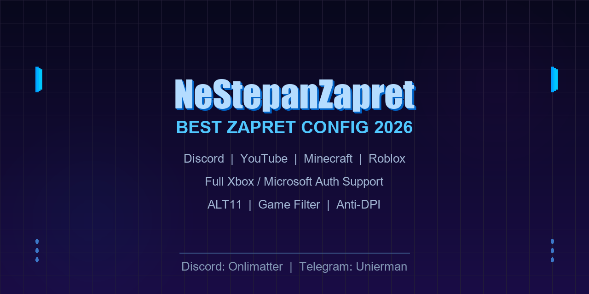

# NeStepanZapret — лучший конфиг zapret

Оптимизирован для Discord, YouTube, Minecraft, Roblox и всего остального.

## Возможности

| Сервис | Статус |
|--------|--------|
| 🎮 **Discord** | Голосовые каналы, стриминг, загрузка файлов |
| ▶️ **YouTube** | Без лагов, полная скорость |
| ⛏️ **Minecraft** | Полная поддержка Microsoft/Xbox auth (Prism Launcher, любой лаунчер) |
| 🔵 **Roblox** | Без разрывов, все функции |
| 🔴 **Twitch / Kick** | Работают |
| 📌 **Pinterest, Reddit** | Работают |
| 🎯 **Game Filter** | Включён (UDP) |

## Установка

1. Скачай последний [релиз zapret-discord-youtube](https://github.com/Flowseal/zapret-discord-youtube)
2. Распакуй архив
3. Скопируй содержимое этой репы **поверх** (заменив файлы)
4. **Через сервис:** `service.bat` → установи сервис, выбери `general (ALT11)`
5. **Или напрямую:** запусти `general (ALT11).bat` от имени администратора

## Альт ALT11

Основной и лучший конфиг — `general (ALT11)`. Содержит все необходимые настройки для обхода DPI:
- TCP: 80, 443, 2053, 2083, 2087, 2096, 8443, 25565 (Minecraft)
- UDP: 443, 19294-19344 (Roblox), 50000-50100 (Roblox)
- Отдельные фильтры для Discord, STUN, QUIC
- Полная поддержка Microsoft / Xbox Live аутентификации
- Исключения для банков, госуслуг и российских сайтов

## Контакты

Discord: **Onlimatter**  
Telegram: **Unierman**
